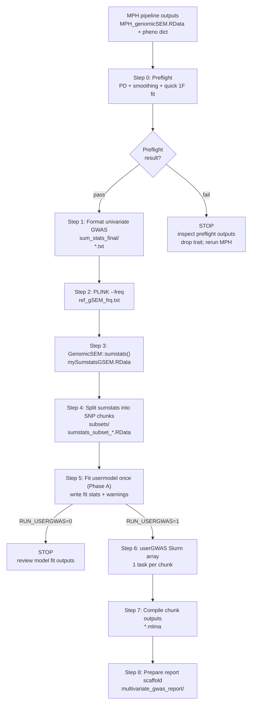

# Pipeline overview

This pipeline assumes you have already run the **MPH pipeline**, and you have:

- `MPH_DIR/gsem/MPH_genomicSEM.RData` (the GenomicSEM covstruc object `mph_out`)
- `MPH_DIR/pheno/pheno_cohort_project_dict.csv` (trait mapping + per-trait sample sizes)

It also assumes you have the **univariate GWAS outputs** (per trait; per chromosome) in a directory (e.g. `UNIV_GWAS_DIR`).

## What the pipeline does

0) **Preflight: sanity-check the MPH/GenomicSEM input matrices**
   - Loads `MPH_DIR/gsem/MPH_genomicSEM.RData` (`mph_out`).
   - Checks whether the input genetic covariance/correlation matrix **S** (and sampling covariance matrix **V**) are positive definite.
   - If **S is non-PD**, the script computes a nearPD-style smoothing and reports the
     maximum absolute change (`smoothing_check.tsv`). By default the pipeline **only stops**
     when that change exceeds a threshold (default **0.025**), which matches how many GenomicSEM workflows triage non-PD warnings.
   - Fits a quick 1-factor model to surface obvious estimation warnings (Heywood cases, etc.).
   - Writes outputs to `GSEM_DIR/results/model_fit/preflight/`.
   - Stops early on **pathological** model fits (non-convergence / Heywood) and on **large smoothing** (configurable).

1) **Prepare GenomicSEM sumstats inputs**
   - Reads your univariate `.mlma` GWAS files.
   - Ensures consistent columns / types.
   - Writes one formatted sumstats file per trait into `GSEM_DIR/sum_stats_final/`.

2) **Create the GenomicSEM reference allele-frequency file**
   - Uses PLINK on your genotype prefix (`GENO_BFILE`).
   - Produces `GSEM_DIR/geno/ref_gSEM_frq.txt`.

3) **Run `GenomicSEM::sumstats()`**
   - Combines all formatted trait sumstats + reference frequencies.
   - Writes `GSEM_DIR/sum_stats_final/mySumstatsGSEM.RData`.

4) **Split the sumstats object into SNP “chunks”**
   - Produces `GSEM_DIR/split_sumstats/sumstats_subset_1.RData`, `..._2.RData`, etc.
   - Writes `GSEM_DIR/split_sumstats/num_SNP_sets.txt`.

5) **Fit a 1-factor usermodel once (sanity check)**
   - Runs `GenomicSEM::usermodel()` using `mph_out`.
   - Captures warnings to plain text.
   - Writes fit stats to `GSEM_DIR/results/model_fit/`.

6) **Run the multivariate GWAS (`GenomicSEM::userGWAS`) as a Slurm array**
   - One array task per SNP chunk.
   - Each task writes a chunk output RData to `GSEM_DIR/results/multivariate_gwas/<MODEL_NAME>/`.

7) **Compile chunk results to MLMA-like files**
   - Converts chunk outputs into `.mlma` files in `MULTIVAR_REPORT_DIR/results/gwas/`.

8) **Prepare the `multivariate_gwas_report/` directory**
   - Creates the folder structure and copies the notebook template.
   - (Optional) copies `genome_info/` and creates a `genotypes/` directory.

## Error handling and restarting

- **If a Slurm array task fails** (often due to a problematic chunk), the compile step will not run.
- Use:
  - `bash bin/find_failed_usergwas_chunks.sh --config config/my_run.sh`
  - then re-submit just those indices:
    - `bash bin/submit_usergwas_array.sh --config config/my_run.sh --array "<indices>"`
- Once all chunks exist, run:
  - `bash bin/submit_compile_and_report.sh --config config/my_run.sh`

Warnings are written to plain-text files (not CSV) so nothing “breaks” due to commas/quotes.

## Workflow diagram

## Checkpoints and restart points

The pipeline is designed to be restartable. Each step writes a **sentinel** `.done` file (or another unambiguous output) so you can rerun `submit_gsem_pipeline.sh` safely.

Common checkpoints:

- **Preflight**: `GSEM_DIR/results/model_fit/preflight/run_summary.tsv`
- **Formatted sumstats**: `GSEM_DIR/sum_stats_final/*.txt` + `.make_sumstats.done`
- **Reference freqs**: `GSEM_DIR/geno/ref_gSEM_frq.txt` + `.make_ref.done`
- **GenomicSEM sumstats**: `GSEM_DIR/sum_stats_final/mySumstatsGSEM.RData` + `.sumstats.done`
- **Split subsets**: `GSEM_DIR/split_sumstats/subsets/sumstats_subset_*.RData` + `num_SNP_sets.txt` + `.split_sumstats.done`
- **Model fit**: `GSEM_DIR/results/model_fit/usermodel_fit.rds`
- **userGWAS chunks**: `GSEM_DIR/results/multivariate_gwas/<MODEL_NAME>/userGWAS_chunk_*.RData`
- **Compiled MLMA**: `MULTIVAR_REPORT_DIR/results/gwas/*.mlma`
